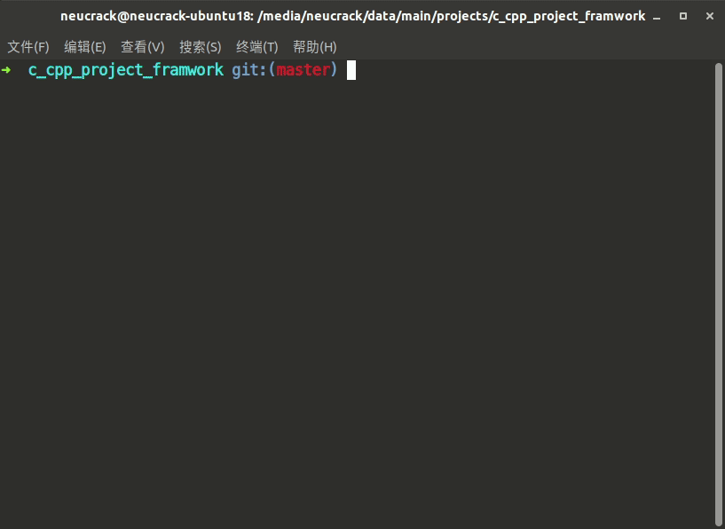
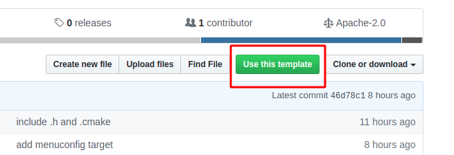

C CPP Project Framework (Template)
===================

[中文](./README_ZH.md)

**Simple** and **configurable** `C/C++` project/SDK template 
> `CMake` build system and support Kconfig with `GUI` configuration

Based on this project, you can quickly build your project construction system and reduce many unnecessary troubles~

If it helps you, please give a little star in the upper right corner~~ If needs improvement, just create an [issue](https://github.com/Neutree/c_cpp_project_framework/issues/new).  `(´ε｀ ʃƪ)♡`


The target developer of this project:

* Developers who are preparing to write `SDK` and need to write their own build system
* Preparing to start writing a project who needs to write a build system
* Who don't know much about `CMake`, but want to learn `CMake`
* Who want to refactor the code engineering build system, maybe because of th bad old messy build system
* Who want to add a very useful configuration system to the build system, you can quickly add and delete code modules as needed, and it is best to have an GUI configuration.
* Who want the project to generate a variety of `IDE` supported projects.





## Get Started

```
cd examples/demo1
# python project.py --toolchain /opt/toolchain/bin --toolchain-prefix mips-elf- config
mkdir build && cd build
cmake ..
make menuconfig
make -j10
./build/demo1
make clean
rm -rf ./*
```

or

```
cd examples/demo1
# python project.py --toolchain /opt/toolchain/bin --toolchain-prefix mips-elf- config
python project.py menuconfig
python project.py build
./build/demo1
python project.py clean
python project.py distclean
# python project.py clean_conf
```

* Change dir to project directory
* Set toolchain path(don't need set if use `gcc`)
* Make a temporary directory and switch the current path to this directory(`build`)
* Generate makefile by command `cmake ..`, `..` means the project directory
* Config project by command `make menuconfig`, it will generate `global_config` files at `build/config` directory, so we can use it in component's `CMakelists.txt` directly， or in `C/CPP` source files by `#include "global_config.h"`
* Build project by command `make`, or parallel build with [make -jN](http://www.gnu.org/software/make/manual/make.html#Parallel)， and output verbose build info with command `make VERBOSE=1`

You can create your github repository with this tempalte by click `use this template` button




## Structure

| directory/file | function |
| -------------- | -------- |
| root directory | root directory of this project, also `SDK` projects' `SDK` directory |
| assets         | store assets like image etc. you can delete it if not use it |
| components     | as a component/lib |
| examples       | project dir or demo dir； `SDK` projects' example/project dir, this directory can be separated from the `SDK` directory, just set environment`MY_SDK_PATH` to `SDK` directory's path. |
| tools          | tools like `cmake`、`kconfig`、`burn tool` etc. |
| Kconfig        | root `Kconfig` configuration |


### 1) Component

All libraries are placed as components in the `components` directory or under the project directory. Each component uses a directory. This directory is the name of the component. In order to make the project look more concise, the components are not nested. All components are a hierarchy, and the relationships between components depend on dependencies to maintain

All source files must be in a component. Each project must contain a component called `main` (ie `examples/demo1/main` directory). Each component contains the following files:

* `CMakeLists.txt`: Must exist, declare the component source file and the dependent component, and call the registration function to register itself. For details, please refer to `CMakeLists.txt` of `components/component1` and `components/component2`.

* `Kconfig`: Optional, contains configuration options for this component. In this component or other `CMakeLists.txt` that depends on the component of this component, you can use these configuration items after adding a `CONFIG_` prefix. e.g. In `components/component2`, there is a `COMPONENT2_ENABLED` option in `Kconfig`. We use this variable `if(CONFIG_COMPONENT2_ENABLED)` in its `CMakeLists.txt` to determine if the user configuration want to register this component or not.

### 2) Project Directory

The project directory is in the `examples` directory. Of course, the name of this directory can be modified according to actual needs. The following can contain multiple actual project directories. You can compile when you need to compile the project and switch to the corresponding directory. As mentioned above, there must be a `main` component in each project directory. Of course, you can also put a lot of custom components. More refer to the `examples/demo1` project directory.

Files under the project directory:

* `CMakeLists.txt`: must exist, project properties file, you must first include `include(${SDK_PATH}/tools/cmake/compile.cmake)`, then use the `project` function to declare project name, such as `project(demo1)`, Of course, you can also write other conditions or variables, etc., using the `CMake` syntax, refer to the `examples/demo1/CMakeLists.txt`

* `config_defaults.mk`: Optional, project default configuration file, the default configuration will be loaded when `cmake` execute. The format of the configuration is `Makefile`. You can use the terminal GUI configuration (`make menuconfig`) to generate the configuration file, the generated configuration file is in `build/config/global_config.mk`, then copy to `config_defaults.mk`.
> Note: After modifying `config_defaults.mk`, you need to delete the files in the `build` directory (or just delete the `mk` file in the `build/config` directory) to regenerate, because the current build system will use the existing configuration file (`build/config/global_config.mk`)


## License

Apache License 2.0， see [LICENSE](./LICENSE)


## Repos used this framwork

* [MaixPy](https://github.com/sipeed/MaixPy/): `Micropython` port for `AIOT` chip `K210`
* [MF1_SDK](https://github.com/sipeed/MF1_SDK): SDK for `MF1` AI module(board)

## Other Reference

* [ESP_IDF](https://github.com/espressif/esp-idf)：  `SDK` of `ESP32`, Written very well
* [Kconfiglib](https://github.com/ulfalizer/Kconfiglib)： `Kconfig`'s `Python` implementation
* [RT-Thread](https://github.com/RT-Thread/rt-thread)：not `CMake`, but also use component

